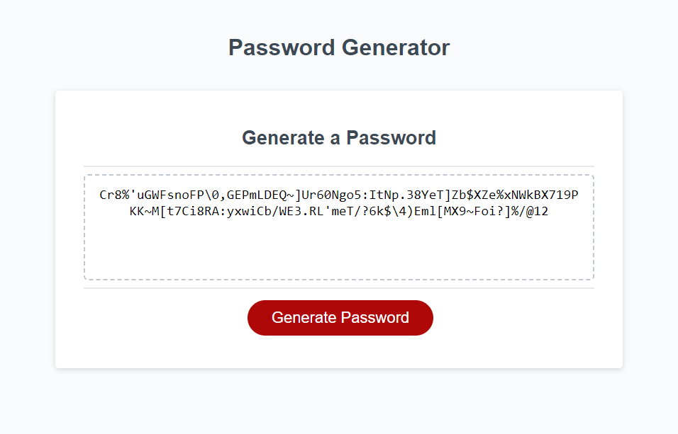

# password-generator
This repository creates a unique password generation system

### REPOSITORY DESCRIPTION

REPOSITORY NAME: password-generator

This repository is created for Assignment 6: passwword generator
It contains and index.html, script.js, style.css accordingly.

### SCREENSHOT

### RELATED LINKS
[Github repository:](https://github.com/Prince-grandev/password-generator)

[Github application:](https://prince-grandev.github.io/password-generator/)

### BRIEF INTRODUCTION
This was a rather interesting project and defintely tested my knowledge of syntax, functions, arrays as well as problem solving.

### ALGORITHM

### CONCLUSION
This exercise pushed the limits of understanding javascript. More importantly was the need to understand how to combine individual functions in order to generate the final system.